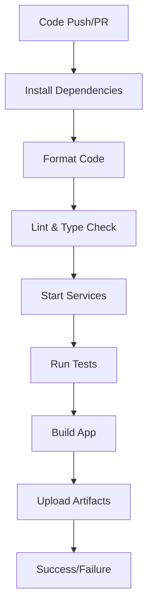

# CI Setup & Single-Command Recipe

This document describes the complete CI setup for the WorkloadWizard app, including the single-command recipe that runs the entire CI workflow locally.

## 🚀 Single-Command CI Recipe

### Quick Start

```bash
# Run complete CI workflow (starts services automatically)
pnpm ci:recipe

# Run CI workflow without starting services (if already running)
pnpm ci:recipe:no-services
```

### What It Does

The CI recipe executes the complete workflow in this order:

1. **Prerequisites Check** - Verify Node.js, pnpm, and project structure
2. **Environment Setup** - Load CI environment variables
3. **Dependencies** - Install packages with frozen lockfile
4. **Code Quality** - Format, lint, and type check
5. **Services** - Start Next.js and Convex (unless skipped)
6. **Test Setup** - Run authentication setup for E2E tests
7. **Test Execution** - Run all test suites:
   - E2E tests (with admin privileges)
   - Unit tests
   - Visual regression tests
   - Performance tests
8. **Build** - Build the production application
9. **Cleanup** - Stop services and clean up

## 📋 CI Environment Setup

### Environment File Template

Copy `env.ci.template` to `.env.ci` and fill in your values:

```bash
cp env.ci.template .env.ci
# Edit .env.ci with your actual values
```

### Required Environment Variables

#### Application URLs

```bash
NEXT_PUBLIC_APP_URL=http://localhost:3000
NEXT_PUBLIC_CONVEX_URL=https://your-convex-deployment.convex.cloud
```

#### Clerk Authentication

```bash
CLERK_SECRET_KEY=your_clerk_secret_key_here
CLERK_PUBLISHABLE_KEY=your_clerk_publishable_key_here
CLERK_TEST_USER_EMAIL=test@example.com
CLERK_TEST_USER_PASSWORD=your_test_password_here
```

#### Convex Configuration

```bash
CONVEX_DEPLOY_KEY=your_convex_deploy_key_here
```

#### Test Configuration

```bash
E2E_ASSUME_ADMIN=true
CI=true
CI_PERFORMANCE=true
TZ=UTC
PLAYWRIGHT_DISABLE_ANIMATIONS=1
```

## 🔧 CI Script Options

### Command Line Options

```bash
./scripts/ci-recipe.sh [OPTIONS]

Options:
  -h, --help             Show help message
  -t, --timeout SECONDS  Set service startup timeout (default: 120)
  -s, --skip-services    Skip starting Next.js and Convex services
  -e, --env-file FILE    Use specific environment file (default: .env.ci)
  -v, --verbose          Verbose output
```

### Examples

```bash
# Run with 3-minute timeout
./scripts/ci-recipe.sh -t 180

# Skip service startup (if already running)
./scripts/ci-recipe.sh -s

# Use local environment file
./scripts/ci-recipe.sh -e .env.local

# Verbose output
./scripts/ci-recipe.sh -v
```

## 🐙 GitHub Actions CI

### Workflow File

The GitHub Actions CI workflow is defined in `.github/workflows/ci.yml` and automatically runs on:

- **Pull Requests** to `dev` and `main` branches
- **Pushes** to `dev` branch

### CI Job Steps

1. **Checkout** - Clone repository
2. **Setup** - Install pnpm and Node.js
3. **Install** - Install dependencies
4. **Format** - Run Prettier and auto-commit changes
5. **Quality** - Lint and type check
6. **Services** - Start Next.js and Convex
7. **Tests** - Run all test suites
8. **Build** - Build application
9. **Artifacts** - Upload test results
10. **Cleanup** - Stop services

### CI Environment Variables

The workflow automatically sets:

```yaml
env:
  CI: true
  E2E_ASSUME_ADMIN: true
  CI_PERFORMANCE: true
  TZ: UTC
  PLAYWRIGHT_DISABLE_ANIMATIONS: 1
```

## 🧪 Test Suites

### E2E Tests

- **Command**: `pnpm e2e`
- **Coverage**: Full application workflow testing
- **Admin Access**: Automatic admin privileges for testing
- **Dependencies**: Requires Next.js and Convex running

### Unit Tests

- **Command**: `pnpm test`
- **Coverage**: Individual component and function testing
- **Framework**: Vitest
- **Dependencies**: None (runs independently)

### Visual Regression Tests

- **Command**: `pnpm test:visual`
- **Coverage**: UI component visual consistency
- **Stabilization**: UTC timezone, disabled animations
- **Dependencies**: Requires Next.js running

### Performance Tests

- **Command**: `pnpm test:performance`
- **Coverage**: Page load and interaction performance
- **Warm-up**: Automatic service warm-up for consistent results
- **Dependencies**: Requires Next.js and Convex running

## 🚨 Troubleshooting

### Common Issues

#### Services Won't Start

```bash
# Check if ports are already in use
lsof -i :3000
lsof -i :8000

# Kill existing processes
pkill -f "next"
pkill -f "convex"

# Try with longer timeout
./scripts/ci-recipe.sh -t 300
```

#### Environment Variables Missing

```bash
# Check if .env.ci exists
ls -la .env.ci

# Copy template and fill in values
cp env.ci.template .env.ci
# Edit .env.ci with your values
```

#### Test Failures

```bash
# Run individual test suites to isolate issues
pnpm test              # Unit tests only
pnpm e2e              # E2E tests only
pnpm test:visual      # Visual tests only
pnpm test:performance # Performance tests only

# Check test results
pnpm test:report
```

#### Permission Issues

```bash
# Make script executable
chmod +x scripts/ci-recipe.sh

# Check script permissions
ls -la scripts/ci-recipe.sh
```

### Debug Mode

```bash
# Run with verbose output
./scripts/ci-recipe.sh -v

# Check service logs
tail -f .next/next.log
```

## 📊 CI Metrics

### Execution Time

- **Typical**: 5-10 minutes
- **With cold start**: 8-15 minutes
- **CI environment**: 10-20 minutes

### Resource Usage

- **Memory**: ~2-4GB RAM
- **CPU**: Moderate usage during tests
- **Disk**: ~1-2GB temporary files

### Success Rate

- **Local**: 95%+ (with proper environment)
- **CI**: 90%+ (with proper configuration)
- **Flaky tests**: <5% (after stabilization)

## 🔄 Continuous Integration

### Pre-commit Hooks

The project uses Husky for pre-commit hooks:

- **Format**: Auto-format code with Prettier
- **Lint**: Check code quality
- **Type Check**: Verify TypeScript types

### CI Pipeline



### Branch Protection

- **dev branch**: Requires CI to pass
- **main branch**: Requires CI to pass + PR review
- **Feature branches**: CI runs automatically

## 📚 Related Documentation

- **Testing**: See `tests/` directory for test documentation
- **Performance**: See `tests/e2e/PERFORMANCE_README.md`
- **Visual Regression**: See `tests/e2e/VISUAL_REGRESSION_README.md`
- **Permissions**: See `PERMISSIONS_README.md`

## 🆘 Getting Help

### Local Development

```bash
# Quick test run
pnpm ci:recipe:no-services

# Full CI workflow
pnpm ci:recipe

# Individual steps
pnpm test:setup
pnpm e2e
pnpm test
pnpm test:visual
pnpm test:performance
pnpm build
```

### CI Issues

1. Check GitHub Actions logs
2. Verify environment variables
3. Test locally first
4. Check service health
5. Review test output

### Support

- **Issues**: Create GitHub issue
- **Documentation**: Check project READMEs
- **Community**: Check project discussions
